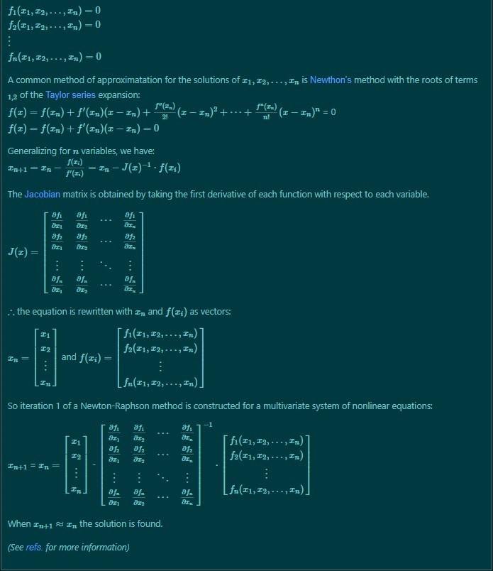
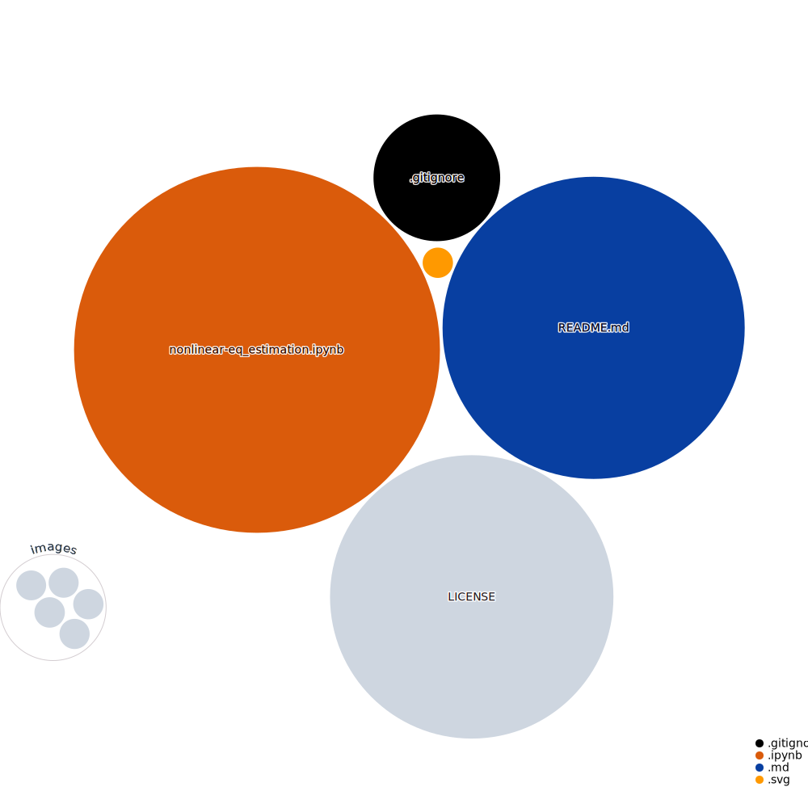

<h1>
 Nonlinear equation params. estimation 
</h1>

### Description:
From $n$ non-linear equations with $x_{1},..., x_n$ unknown variables a multivariate system of nonlinear equations with 
dimensional compatibility can be expressed:  

 
 
  

###### <b>LaTeX parsed (Mobile):</b> 

 
 
  

###### <b>LaTeX [GFM](https://github.github.com/gfm/) parsed (Web):</b> 

If we have: 

$f_1(x_1,x_2,...,x_n) = 0$  
$f_2(x_1,x_2,...,x_n) = 0$  
$\vdots$  
$f_n(x_1,x_2,...,x_n) = 0$  

A common method of approximation with Linear Algebra & Numerical Methods, can help us find the roots of $x_1,x_2,...,x_n$.   
Theoretically, we could use [Newton Raphson's](README.md#References) method with the roots of only the first terms ${ }_{1,2}$ of the [Taylor series](README.md#References) expansion:     

$f(x) = f(x_n) + f'(x_n)(x-x_n) + \frac{f''(x_n)}{2!}(x-x_n)^2 +\cdots + \frac{f^{n}(x_n)}{n!}(x-x_n)^n$ = 0 
$f(x) = f(x_n) + f'(x_n)(x-x_n) = 0$  

Generalizing for $n$ variables, we have:  
$x_{n+1} = x_n - \frac{f(x_i)}{f'(x_i)} = x_n - J(x)^{-1} \cdot f(x_i)$ 
 

The [Jacobian](README.md#References) matrix is obtained by taking the first derivative of each function with respect to each variable.  

$$
(x) = \begin{bmatrix}
\frac{\partial f_1}{\partial x_1} & \frac{\partial f_1}{\partial x_2} & \cdots & \frac{\partial f_1}{\partial x_n} \\
\frac{\partial f_2}{\partial x_1} & \frac{\partial f_2}{\partial x_2} & \cdots & \frac{\partial f_2}{\partial x_n} \\
\vdots & \vdots & \ddots & \vdots \\
\frac{\partial f_n}{\partial x_1} & \frac{\partial f_n}{\partial x_2} & \cdots & \frac{\partial f_n}{\partial x_n} \\
\end{bmatrix}
$$

$\therefore$ the equation is rewritten with $x_n$ and $f(x_i)$ as vectors evaluated in $x_n$ : 

$x_n = [x_1, x_2, ..., x_n]^T$  
$f(x_i) = [f_1(x_1,x_2,...,x_n)$, $f_2(x_1,x_2,...,x_n)$, $\cdots$ , $f_n(x_1,x_2,...,x_n)]^T$

 

So iteration No. $1$ of a Newton-Raphson method is constructed for the multivariate system of nonlinear equations: 
  

<i> (see [refs.](README.md#Referencess) for more info.) </i> 

<b> The solution is found when $|x_{n+1} \pm x_n| \approx 0$. (10 approx.)</b>

  

From [`Scipy: Non-linear solvers`](README.md#References) [`fsolve`](README.md#References) is used to estimate $f(x)$ distribution. 

The dataset <b>Cumulative Distribution</b> is:

$F(X)$ = ${Pr}(a \leq  X \leq b)$:

<i><b>Note:</b> Analytical tests should be performed to validate $f(x)$ & the obtained params $x_i,x_2,...,x_n:$</i>

$$F(X) = \int_{a}^{b} f(x) dx$$ 

$\therefore$ the <b>Expectancy</b> can be expressed as $E[Y]$:

$$E [Y] = \hat{F}^{N} = \int_{a}^{b} x f(x) dx$$ 

And $\hat{F}^{N}$ can be modelled with samplings from $N$ random variables $X \sim U(a,b)$.

### **Results:**

+ $X\sim\beta(\alpha, \beta)$ with $f(x_{i}, f_{x_{i}}):$  

|   x   |   f(x)   |   F(x)   |
|-------|---------|---------|
| 40.00 |   inf   | 0.000000|
| 40.01 | 1.040696| 0.019154|
| 40.02 | 0.758528| 0.027915|
| 40.03 | 0.630507| 0.034797|
| 40.04 | 0.553063| 0.040688|
|  ...  |   ...   |   ...   |
| 48.95 | 0.247013| 0.981838|
| 48.96 | 0.265219| 0.984395|
| 48.97 | 0.290729| 0.987167|
| 48.98 | 0.330971| 0.990257|
| 48.99 | 0.413234| 0.993916|

.png)  

 

+ $X\sim\text{T}(a,b,c)$:

|   x   |   f(x)   |   F(x)   |
|-------|---------|---------|
|  0    | 40.000000| 0.000000|
|  1    | 40.090909| 0.005102|
|  2    | 40.181818| 0.010203|
|  3    | 40.272727| 0.015305|
|  4    | 40.363636| 0.020406|
|  ...  |   ...   |   ...   |
|  95   | 48.636364| 0.997085|
|  96   | 48.727273| 0.998360|
|  97   | 48.818182| 0.999271|
|  98   | 48.909091| 0.999818|
|  99   | 49.000000| 1.000000|

.png)  

+ Montecarlo Estimation: 

[gh-app](https://github.com/EstebanMqz/Non-linear-equation-Parameter-estimation/blob/main/images/MC.jpg) 

if $V$ is the volume of an integral 

$$V = \int_{a}^{b} f(x) dx$$
   
and it follows a uniform prob. density function $f(x)$ $X \sim U(a,b)$ it can be modelled with `np.random.uniform`. 

$f(x) = \frac{1}{b-a}$ if $a \leq x \leq b$  
$0$ otherwise

<i>Nevertheless if the distribution isn't known it must be obtained from data or modelled with another method.</i>

From where we've got by the definition the expectancy: 

$$E[X] = \int_{a}^{b} x f(x) dx$$

Then, the mean of $x_{i}$ in $V$ is:

$$F = \frac{V}{N} \sum_{i=0}^{N-1} f\left(x_i\right)$$

if $N = N-1$ the equation can be rewritten from the solution of the integral as:
$$F = \frac{b-a}{N-1} \sum_{i=0}^N f\left(x_i\right)$$

But Montecarlo estimations for $N$ random variables $X \sim U(a,b)$ must include the error  $\xi$. 
$\therefore$, the estimator can be expressed with the solution of the integral for all possible errors $\xi \in$ $(0,1]$ $\rightarrow$ $a = b$ :

$$\hat{F}^{N} = \frac{b-a}{N-1} \sum_{i=0}^{N} f\bigg[a + \xi(b-a)\bigg]$$

---

##### Repository: 

 

    

#### References: 

[`Non-Linear Solvers`](https://docs.scipy.org/doc/scipy/reference/optimize.html#id3)

[`Newton Raphson`](https://en.wikipedia.org/wiki/Newton%27s_method) [`Taylor-Series`](https://en.wikipedia.org/wiki/Taylor_series) [`Jacobian`](https://en.wikipedia.org/wiki/Jacobian_matrix_and_determinant)

[`scipy.optimize.fsolve`](https://docs.scipy.org/doc/scipy/reference/generated/scipy.optimize.fsolve.html) 

[`scipy.stats.beta`](https://docs.scipy.org/doc/scipy/reference/generated/scipy.stats.beta.html) $X\sim\beta(\alpha, \beta)$  

[`scipy.stats.gamma`](https://docs.scipy.org/doc/scipy/reference/generated/scipy.stats.gamma.html)
$X\sim\Gamma(\alpha, \beta)$  

[`scipy.stats.triang`](https://docs.scipy.org/doc/scipy/reference/generated/scipy.stats.triang.html)
$X\sim\text{T}(a,b,c)$ 

[`Monte Carlo Estimation`](https://phyusdb.files.wordpress.com/2013/03/monte-carlo-methods-second-revised-and-enlarged-edition.pdf)

<link rel="stylesheet" href="https://cdn.jsdelivr.net/npm/water.css@2/out/dark.min.css">

 
 <i>Tools:</i> 
 

##### Actions:   
##### Main Text-Editor:     
##### Language:         
##### Libraries:     
##### Web-Interface:&nbsp;&nbsp; 
##### Version Control:&nbsp;&nbsp; 
  

##### License:&nbsp; 

 
 <b>Business Inquiries:</b> 
 

 

&#x26A1;Availability: <i> 24/7 on <b>WA$_{Business}$</b> 

  </b>  (password):</i> <b>"Marquez"</b> 

  

 

