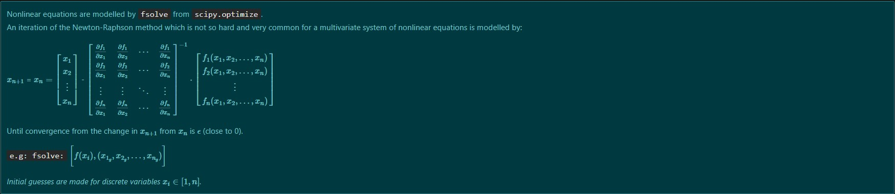

## **Non-linear-eq-params.-Estimators.**

#### **Repository Tools:**

 <b>Click to expand</b> 

##### Actions:   
##### Main Text-Editor:     
##### Language:         
##### Libraries:     
##### Web-Interface:&nbsp;&nbsp; 
##### Version Control:&nbsp;&nbsp; 
  

##### License:&nbsp; 

##### Work Contact: 

 <b>Click to expand</b> 

   

 

##### **Diagram:**

  

## **Description:**

The main goal is to illustrate theoretically and practically the process on how to solve non-linear equations systems to estimate parameters for distributions $f(x)$, to obtain: 

$F(X)$ = ${Pr}(\{a \leq X \leq b\})$  $$F(X) = \int_{a}^{b} f(x) dx$$  

And its expected value:

$$E [Y] = \hat{F}^{N} = \int_{a}^{b} x f(x) dx$$ 

Theoretically demonstrating $\hat{F}^{N}$ for $N$ random variables $x_{i} \in$ $[a,b] \sim U(a,b)$.

*Tests should be performed to validate the distribution and its parameters.* 

Afterwards Montecarlo (stratified) Samplings convergence speeds are compared between raw samplings and divided into $N$ strata. 

### **Results:**

+ For $x\sim\beta(\alpha, \beta)$ against $X\sim\beta$ prob. for data :  
$$x_{i_{\beta}}, f(x_{i_{\beta}})$$  

 

+ For $x\sim\text{T}(a,b,c)$ with params $\alpha, \beta = a,b$ and $c_{(Mo)_{given}}$  
compared against $X\sim\text{T}(a,b,c)$ accum. prob for data :

$$x_{i_{T}}, f(x_{i_{T}})$$  

  

+ Montecarlo Raw & Stratified Samplings:  

  

##### References: 
[`scipy.optimize.fsolve`](https://docs.scipy.org/doc/scipy/reference/generated/scipy.optimize.fsolve.html) 
[`scipy.stats.beta`](https://docs.scipy.org/doc/scipy/reference/generated/scipy.stats.beta.html) 
$x\sim\beta(\alpha, \beta)$ 
[`scipy.stats.gamma`](https://docs.scipy.org/doc/scipy/reference/generated/scipy.stats.gamma.html)  
$x\sim\Gamma(\alpha, \beta)$ 
[`scipy.stats.triang`](https://docs.scipy.org/doc/scipy/reference/generated/scipy.stats.triang.html) 
$x\sim\text{T}(a,b,c)$

