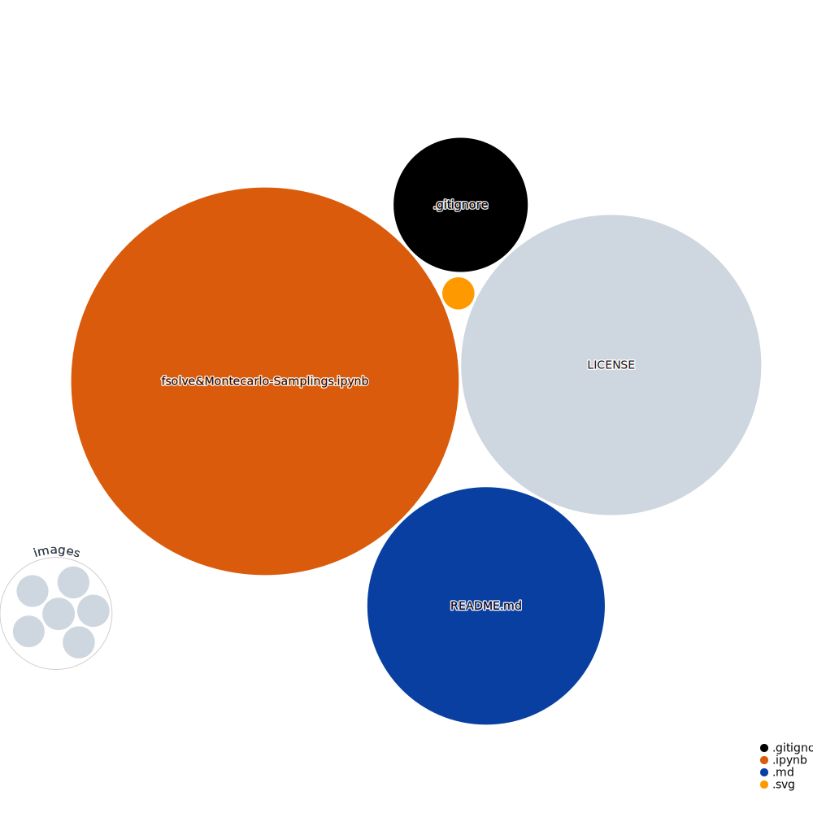

## **Nonlinear equation params. estimation**

 <i>Tools:</i> 

##### Actions:   
##### Main Text-Editor:     
##### Language:         
##### Libraries:     
##### Web-Interface:&nbsp;&nbsp; 
##### Version Control:&nbsp;&nbsp; 
  

##### License:&nbsp; 

 <i>Repo Visualization:</i> 

  

 <i>Contact:</i> 

   

 

---

## **Description:**

Using [`fsolve`](#README.md#References) to solve for non-linear equations systems to estimate params. for distributions $f(x)$, to obtain:

$F(X)$ = ${Pr}(a \leq X \leq b)$:

<i>Analytical tests should be performed to validate $f(x)$ $\&$ the obtained params:</i>

$$F(X) = \int_{a}^{b} f(x) dx$$ 

$\therefore$ Obtain the expectancy $E[Y]$:

$$E [Y] = \hat{F}^{N} = \int_{a}^{b} x f(x) dx$$ 

Where $\hat{F}^{N}$ can be modelled with samplings from $N$ random variables $X \sim U(a,b)$.

### **Results:**

+ For $X\sim\beta(\alpha, \beta)$ for data $f(x_{i}, f_{x_{i}}):$  

|   x   |   f(x)   |   F(x)   |
|-------|---------|---------|
| 40.00 |   inf   | 0.000000|
| 40.01 | 1.040696| 0.019154|
| 40.02 | 0.758528| 0.027915|
| 40.03 | 0.630507| 0.034797|
| 40.04 | 0.553063| 0.040688|
|  ...  |   ...   |   ...   |
| 48.95 | 0.247013| 0.981838|
| 48.96 | 0.265219| 0.984395|
| 48.97 | 0.290729| 0.987167|
| 48.98 | 0.330971| 0.990257|
| 48.99 | 0.413234| 0.993916|

.png)

 

+ For $X\sim\text{T}(a,b,c)$:

|   x   |   f(x)   |   F(x)   |
|-------|---------|---------|
|  0    | 40.000000| 0.000000|
|  1    | 40.090909| 0.005102|
|  2    | 40.181818| 0.010203|
|  3    | 40.272727| 0.015305|
|  4    | 40.363636| 0.020406|
|  ...  |   ...   |   ...   |
|  95   | 48.636364| 0.997085|
|  96   | 48.727273| 0.998360|
|  97   | 48.818182| 0.999271|
|  98   | 48.909091| 0.999818|
|  99   | 49.000000| 1.000000|

.png)  

+ Montecarlo Estimation: 

 

<i>(See [Nbrender]())</i>

##### References: 
[`Newton Raphson`](https://en.wikipedia.org/wiki/Newton%27s_method) [`Taylor-Series`](https://en.wikipedia.org/wiki/Taylor_series) [`Jacobian`](https://en.wikipedia.org/wiki/Jacobian_matrix_and_determinant)

[`scipy.optimize.fsolve`](https://docs.scipy.org/doc/scipy/reference/generated/scipy.optimize.fsolve.html) 

$X\sim\beta(\alpha, \beta)$ [`scipy.stats.beta`](https://docs.scipy.org/doc/scipy/reference/generated/scipy.stats.beta.html) 

$X\sim\Gamma(\alpha, \beta)$ [`scipy.stats.gamma`](https://docs.scipy.org/doc/scipy/reference/generated/scipy.stats.gamma.html) 

$X\sim\text{T}(a,b,c)$ [`scipy.stats.triang`](https://docs.scipy.org/doc/scipy/reference/generated/scipy.stats.triang.html)

[`Monte Carlo Estimation`](https://phyusdb.files.wordpress.com/2013/03/monte-carlo-methods-second-revised-and-enlarged-edition.pdf)
